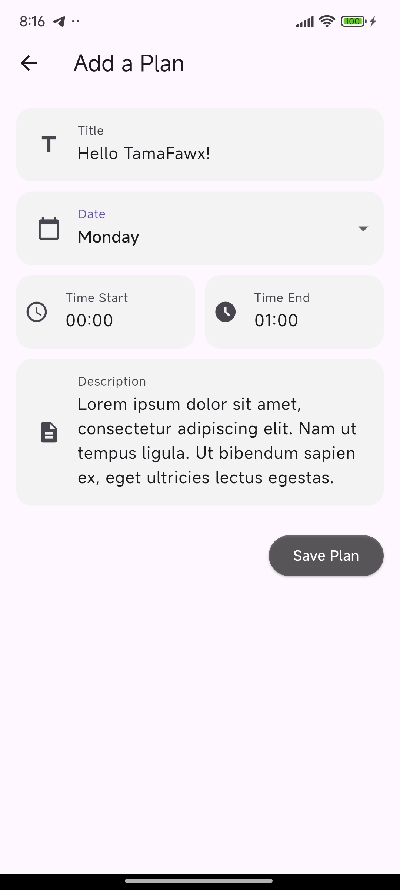

# Daily Planner App

A simple, efficient **Daily Planner** application built with **Flutter** and **SQLite**. This app helps users organize their daily schedules from Monday to Sunday with a clean and intuitive interface.

## 🌟 Key Features

- **Daily Scheduling:** Manage plans specifically for each day of the week (Monday - Sunday).
- **Complete CRUD Operations:**
  - **Create:** Add new plans with a title, description, start time, and finish time.
  - **Read:** View a list of daily plans sorted chronologically.
  - **Update:** Edit existing plans easily.
  - **Delete:** Remove plans that are no longer needed.
- **Local Storage:** Uses **SQLite** to store data persistently on the device.
- **Multi-Platform Support:**
  - **Mobile:** Android
- **User Friendly:**
  - **Tap** on a card to edit a plan.
  - **Long Press** on a card to delete a plan.

## 🛠️ Tech Stack

- **Framework:** [Flutter](https://flutter.dev/) (Dart SDK ^3.10.4)
- **Database:** [sqflite](https://pub.dev/packages/sqflite)
- **Desktop Database:** [sqflite_common_ffi](https://pub.dev/packages/sqflite_common_ffi)
- **Icons:** Cupertino Icons & Material Design

## 📸 Screenshots

|                Home Screen                 |               Add Plan               |
| :----------------------------------------: | :----------------------------------: |
|  |  |

## 🚀 How to Run

Ensure you have the Flutter SDK installed on your machine.

1.  **Clone this repository:**

    ```bash
    git clone [https://github.com/priatmanas/daily-planner-app.git](https://github.com/priatmanas/daily-planner-app.git)
    ```

2.  **Navigate to the project directory:**

    ```bash
    cd daily-planner-app
    ```

3.  **Install dependencies:**

    ```bash
    flutter pub get
    ```

4.  **Run the app:**
    - **Mobile (Android/iOS):**
      ```bash
      flutter run
      ```
    - **Desktop (Windows/Linux/macOS):**
      ```bash
      flutter run -d windows
      # or linux / macos
      ```

## 📂 Project Structure

- `lib/main.dart`: Entry point, theme setup, and Home screen logic.
- `lib/database_connection.dart`: SQLite database management (Singleton), migration, and CRUD methods.
- `lib/daily_plan.dart`: Data model for the Plan object.
- `lib/input_plan.dart`: Form screen for adding new plans.
- `lib/edit_plan.dart`: Form screen for editing existing plans.
- `lib/delete_plan.dart`: Confirmation screen for deleting plans.

## 👤 Author

Made with ❤️ by:

- **Fawzan Priatmana** (@TamaFawx)
- GitHub: [priatmanas](https://github.com/priatmanas)

---

_Created for a college end semester project._
